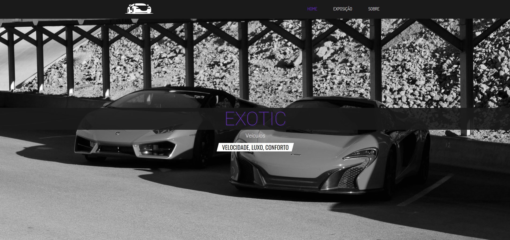

<h1 align="center">Veículos Exóticos</h1>

  

O conceito do site consiste em um aluguel online de veículos raros, de luxo ou esportivos para exposição. Foi usado como base um exercício prático de um curso de Front-end, porém com um conceito próprio, além de mídias e informações alteradas.

Projeto básico com HTML, CSS e JavaScript. O exercício aqui foi de aprimorar estas tecnologias, além de exercitar os novos conhecimentos de branches com git, entre outros comandos.

